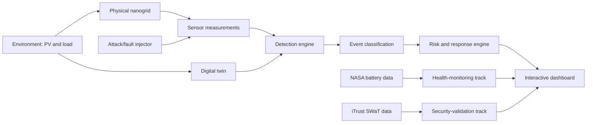
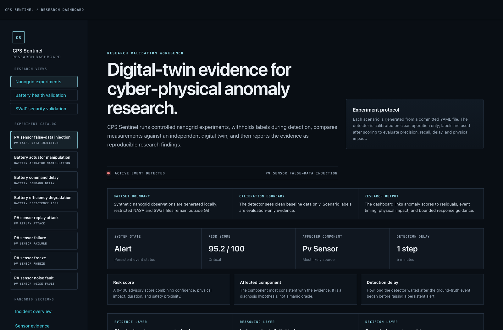
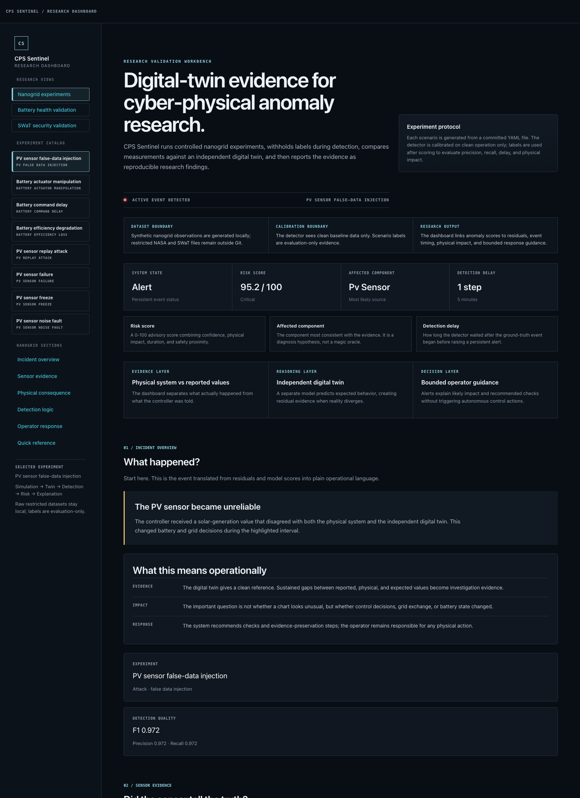

# CPS Sentinel

**Digital Twin-Based Security and Health Monitoring for Cyber-Physical Systems**

[](https://github.com/AVryonides/cps-sentinel/actions/workflows/ci.yml)


CPS Sentinel is a research prototype for detecting, explaining, and responding to faults and
cyberattacks in cyber-physical systems. Its central system is a simulated smart nanogrid paired
with an independent physics-aware digital twin.

NASA battery data provides an external health-prognostics validation track. The iTrust SWaT
dataset provides a separate industrial attack-detection validation track. These tracks share
evaluation and alert interfaces; they are not treated as one physical system.

## System architecture



The main product path is the nanogrid monitoring pipeline: environment, physical model, attacked
measurements, independent digital twin, detector, event classification, risk scoring, and dashboard.
NASA and SWaT are external validation tracks that prove the same monitoring language can also
support health and industrial-security datasets.

## Dashboard preview

The NiceGUI dashboard presents the project as a research validation workbench: experiment catalog,
calibration boundary, event evidence, risk scoring, and explainable response guidance in one view.



<details>
<summary>View taller research-flow screenshot</summary>



</details>

## What this project demonstrates

- A physics-aware nanogrid simulator with PV generation, load, battery state of charge, and grid
  exchange.
- An independent digital twin that produces expected behavior and residual evidence.
- Scenario-driven cyberattack/fault injection with ground-truth labels kept separate from
  detection.
- Hybrid detection using robust physical thresholds, statistical novelty, and temporal persistence.
- Risk-ranked, bounded response recommendations for human operators.
- External validation tracks for NASA battery prognostics and iTrust SWaT industrial attack
  detection.
- A NiceGUI operations dashboard designed for explainability, not just charts.
- Reproducible CLI workflows for simulation, detection, benchmark generation, and incident reports.

## Current validation snapshot

| Track | Dataset / source | Current result |
| --- | --- | --- |
| Nanogrid attack demo | Deterministic smart-nanogrid scenario | F1 0.972, risk score 95.2/100, one persistent incident |
| Nanogrid scenario benchmark | 8 committed attack/fault scenarios | 8/8 events detected, average F1 0.886 |
| Battery health | NASA battery aging data | 4 batteries, 636 discharge cycles, RUL MAE 8.99 cycles |
| Industrial security | iTrust SWaT.A4/A5 July 2019 | 5/6 scheduled attacks detected, point F1 0.446, FPR 11.93% |

The SWaT point-level score is intentionally reported honestly: current performance is useful at
incident/event level, while point recall remains a future-improvement target.

## Quick start

The project supports Python 3.11–3.13. Python 3.11 is used for local development.

### macOS

If Python 3.11 is not installed, one option is:

```bash
brew install python@3.11
```

```bash
python3.11 -m venv .venv
source .venv/bin/activate
python -m pip install --upgrade pip
python -m pip install -e '.[dev]'
```

### Linux

Install Python 3.11 with your distribution package manager if needed. On Debian/Ubuntu-based
systems, that usually means:

```bash
sudo apt update
sudo apt install python3.11 python3.11-venv
```

```bash
python3.11 -m venv .venv
source .venv/bin/activate
python -m pip install --upgrade pip
python -m pip install -e '.[dev]'
```

### Windows PowerShell

Install Python 3.11 from the Microsoft Store or from
[python.org](https://www.python.org/downloads/), then run:

```powershell
py -3.11 -m venv .venv
.\.venv\Scripts\Activate.ps1
python -m pip install --upgrade pip
python -m pip install -e ".[dev]"
```

If PowerShell blocks the activation script, allow scripts for the current user and try again:

```powershell
Set-ExecutionPolicy -ExecutionPolicy RemoteSigned -Scope CurrentUser
.\.venv\Scripts\Activate.ps1
```

Run the test and quality checks:

```bash
pytest --cov --cov-report=term-missing
ruff check .
mypy src
```

Run the dashboard:

```bash
python app/nicegui_app.py
```

If port 8080 is busy, choose another port.

macOS/Linux:

```bash
CPS_SENTINEL_PORT=8081 python app/nicegui_app.py
```

Windows PowerShell:

```powershell
$env:CPS_SENTINEL_PORT = "8081"
python app/nicegui_app.py
```

Most workflow examples below use macOS/Linux line continuations with `\`. On Windows PowerShell,
run the command on one line or replace `\` with PowerShell backticks.

## Core workflows

Validate the configuration:

```bash
cps-sentinel validate --config config/default.yaml
```

Run the nanogrid simulator:

```bash
cps-sentinel simulate \
  --config config/default.yaml \
  --output data/simulated/baseline.csv \
  --plot reports/figures/baseline.html
```

Run the independent digital twin:

```bash
cps-sentinel twin \
  --config config/default.yaml \
  --output data/simulated/twin-baseline.csv \
  --plot reports/figures/twin-baseline.html
```

Run a closed-loop attack scenario:

```bash
cps-sentinel scenario \
  --config config/default.yaml \
  --scenario config/scenarios/pv-false-data-injection.yaml \
  --output data/simulated/pv-fdi.csv \
  --plot reports/figures/pv-fdi.html
```

Run hybrid detection and diagnosis:

```bash
cps-sentinel detect \
  --config config/default.yaml \
  --scenario config/scenarios/pv-false-data-injection.yaml \
  --output data/simulated/pv-fdi-detection.csv \
  --events data/simulated/pv-fdi-events.json \
  --plot reports/figures/pv-fdi-detection.html
```

Run risk assessment and bounded response guidance:

```bash
cps-sentinel assess \
  --config config/default.yaml \
  --scenario config/scenarios/pv-false-data-injection.yaml \
  --output data/simulated/pv-fdi-assessment.csv \
  --alerts data/simulated/pv-fdi-alerts.json \
  --plot reports/figures/pv-fdi-risk.html
```

Generate an operator-facing incident report:

```bash
cps-sentinel report \
  --config config/default.yaml \
  --scenario config/scenarios/pv-false-data-injection.yaml \
  --output reports/incidents/nanogrid-incident-report.md
```

Generate a scenario benchmark matrix:

```bash
cps-sentinel benchmark \
  --config config/default.yaml \
  --scenario-dir config/scenarios \
  --output reports/benchmarks/scenario-benchmark.csv \
  --report reports/benchmarks/scenario-benchmark.md
```

Generate a reproducible local demo bundle:

```bash
cps-sentinel demo \
  --config config/default.yaml \
  --output-dir reports/demo
```

## External validation tracks

Run NASA battery health validation after downloading and extracting the official archive:

```bash
cps-sentinel health \
  --config config/default.yaml \
  --input data/raw/nasa/battery-aging-fy08q4 \
  --output data/processed/nasa-battery-health.csv \
  --alerts data/processed/nasa-health-alerts.json \
  --plot reports/figures/nasa-battery-health.html
```

The health track extracts discharge capacity, calculates state of health, performs causal
remaining-useful-life projection, evaluates predictions against observed end of life, and emits
maintenance-oriented health alerts.

Run iTrust SWaT security validation with the authorized SWaT.A4/A5 July 2019 historian workbook
and companion attack schedule:

```bash
cps-sentinel swat \
  --config config/default.yaml \
  --scheduled-run "data/raw/itrust/SWaT.A4 & A5_Jul 2019/SWaT_dataset_Jul 19 v2.xlsx" \
  --schedule swat-a4-a5-jul-2019 \
  --output data/processed/swat-security.csv \
  --events data/processed/swat-security-events.json \
  --plot reports/figures/swat-security.html
```

The SWaT track learns multivariate process behavior only from clean data, detects persistent
deviations in the labeled run, evaluates point and event performance, and identifies the process
tags contributing most strongly to each event.

## Repository map

| Path | Purpose |
| --- | --- |
| `src/cps_sentinel/` | Simulation, twin, detection, risk, health, SWaT, and demo workflow code |
| `app/nicegui_app.py` | Unified NiceGUI operations dashboard |
| `config/default.yaml` | Main model, detector, risk, and health configuration |
| `config/scenarios/` | Reproducible attack/fault scenario definitions |
| `docs/assets/` | README screenshots and public visual assets |
| `docs/architecture.md` | Architecture notes and system-boundary explanation |
| `docs/technical-overview.md` | Technical overview, results, and data boundaries |
| `docs/demo-walkthrough.md` | Demo flow and showcase commands |
| `reports/demo/` | Local generated demo artifacts; ignored by Git |
| `reports/incidents/` | Local generated incident reports; ignored by Git |
| `reports/benchmarks/` | Local generated scenario benchmark artifacts; ignored by Git |
| `data/raw/` | Local-only restricted datasets; ignored by Git |

## Key engineering conventions

- Battery power is positive for discharge and negative for charge.
- Grid power is positive for import and negative for export.
- `battery_soc` is the end-of-timestep state of charge.
- Expected values come from time-based reference profiles and independent twin state.
- Observed sensor values are used only to calculate residuals after prediction.
- Scenario labels are withheld from detection and used only afterward for evaluation.
- Recommended actions are bounded, reversible decision support, not autonomous actuation.

## Data policy

Raw and processed datasets are excluded from Git. In particular, iTrust datasets must not be
redistributed.

## Project documents

- [Architecture notes](docs/architecture.md)
- [Technical overview](docs/technical-overview.md)
- [Demo walkthrough](docs/demo-walkthrough.md)
