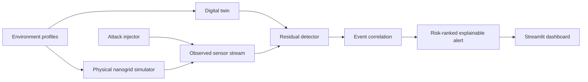

# Architecture

## Product boundary

The smart nanogrid simulation and digital twin form the central CPS Sentinel product.
External datasets are validation tracks:

- NASA battery data validates degradation and remaining-useful-life methods.
- iTrust SWaT data validates industrial attack-detection methods.

They share data contracts, evaluation conventions, and alert schemas without pretending to
describe the same physical plant.

## First vertical slice

The controller may consume an attacked measurement, while the twin must retain an
independent basis for estimating expected behavior. That separation prevents a compromised
sensor from corrupting both sides of the residual comparison identically.

## Engineering principles

- Deterministic simulation from explicit seeds and configuration.
- Physical units in names and interfaces.
- Conservation and operating-limit checks as executable invariants.
- Time-aware evaluation with no future-data leakage.
- Recommended responses are advisory and include assumptions and confidence.
- Dataset provenance and usage restrictions are documented and enforced by Git ignores.
